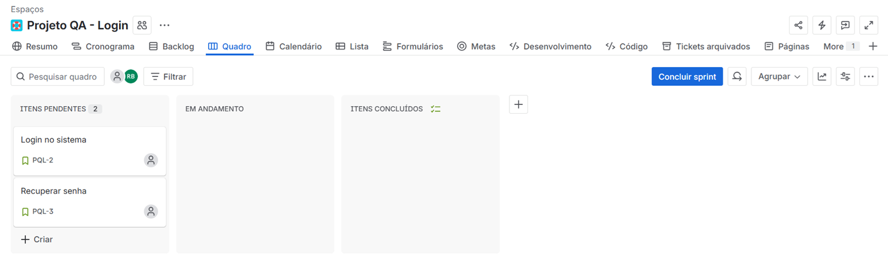
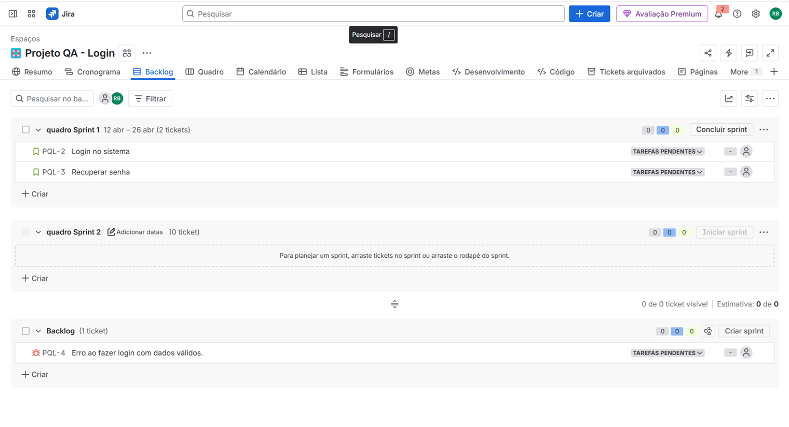
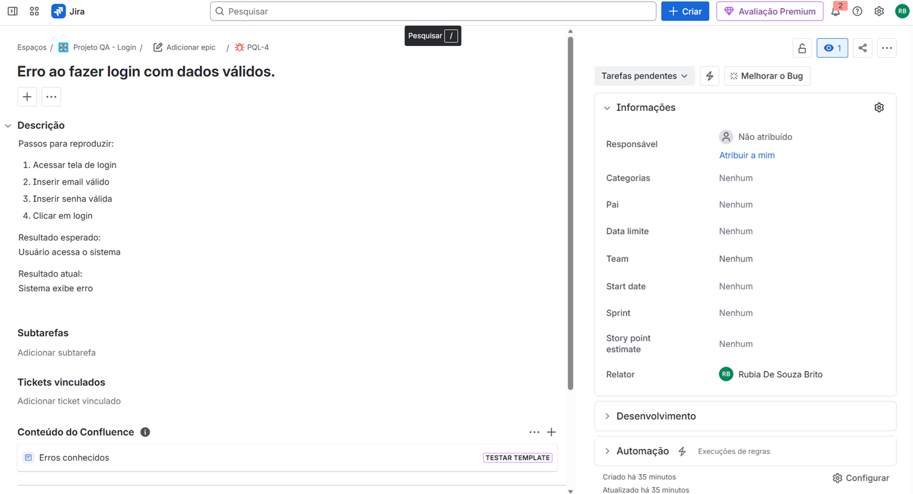

Projeto QA - DIO

Este projeto foi desenvolvido como parte de um desafio prático com foco em Qualidade de Software (QA), simulando um ambiente real de trabalho utilizando metodologia ágil.

---

🎯 Objetivo

Aplicar na prática conceitos de QA, incluindo:

- Criação de User Stories
- Modelagem de fluxo de trabalho
- Elaboração de casos de teste
- Escrita de cenários BDD
- Uso de ferramentas do mercado

---

🚀 Metodologia

O projeto foi estruturado utilizando Scrum, com apoio do Jira para organização das atividades:

- Backlog com User Stories
- Criação de Sprint
- Gerenciamento de tarefas em quadro (Board)
- Registro de Bug

---

🛠️ Ferramentas Utilizadas

- Jira (gestão de tarefas e Scrum)
- Draw.io (mind map)
- GitHub (versionamento e entrega)

---

📂 Estrutura do Projeto

- 📄 fluxo-de-trabalho.pdf
- 📄 user-stories.pdf
- 📄 casos-de-teste.pdf
- 📄 bdd.pdf
- 🧠 mind-map.png

---

🧪 Casos de Teste

Foram elaborados casos de teste utilizando:

- Técnica step-by-step
- Abordagem BDD (Behavior Driven Development)

---

🐞 Controle de Bugs

Foi simulado o registro de um bug no Jira para representar falhas reais no sistema, incluindo descrição e passos para reprodução.

---

📊 Jira - Scrum

📌 Quadro (Board)

📌 Backlog

📌 Bug

---

💡 Considerações Finais

Este projeto permitiu aplicar na prática conceitos fundamentais de QA, além de proporcionar experiência com ferramentas amplamente utilizadas no mercado.

---

👩‍💻 Autora

Desenvolvido por Rúbia
